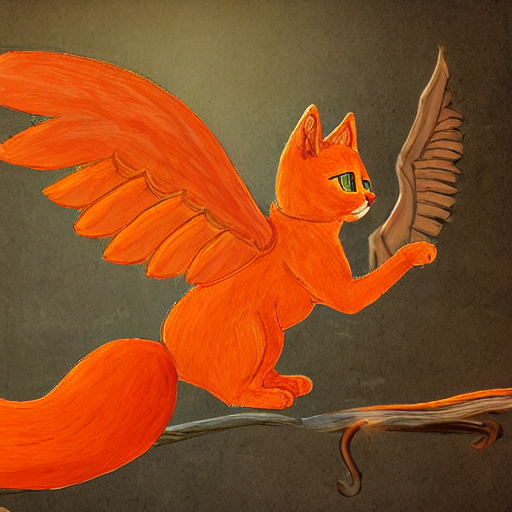

# GenAI_Text2Image: Text-to-Image Generation Using Stable Diffusion

---

## 📚 Overview

This project explores **text-to-image generation** using **Stable Diffusion v1.5**, implemented as a **research-driven, code-integrated notebook**.  
The work covers both theoretical aspects of generative models and practical implementation, allowing users to generate images from natural language prompts.

The project also includes:

- An **interactive GUI demo** (`demo_gui.py`) for quick image generation
- Full research paper structure inside the `.ipynb` file
- Quantitative and qualitative analysis of prompt sensitivity and model behavior

---

## 🚀 Features

- Text-to-image generation based on user prompts
- Support for prompt variations and augmented datasets
- CLIP-based similarity scoring for evaluation
- Visual analysis of biases and hallucinations
- Interactive GUI for real-time generation
- Full modular code and detailed academic structure

---

## 🛠️ Project Structure

```
GenAI_Text2Image/
│
├── GenAI_Text2Image.ipynb     # Main research notebook with all code and sections
├── demo_gui.py                # Standalone GUI for text-to-image demo
├── demo_outputs/              # Folder containing generated images
├── assets/                    # (Optional) diagrams, visuals
└── README.md                  # This file
```

---

## 🖥️ How to Run the Notebook

1. Install dependencies:

   ```bash
   pip install torch torchvision diffusers transformers accelerate scipy matplotlib Pillow
   ```

2. Launch Jupyter Notebook:

   ```bash
   jupyter notebook
   ```

3. Open and run all cells in `GenAI_Text2Image.ipynb`.(It will take time if its running on the cpu)

---

## 🎛️ How to Run the GUI Demo

1. Ensure all required libraries are installed (same as above).
2. From the project folder, run:

   ```bash
   python demo_gui.py
   ```

3. Enter a text prompt, and a generated image will pop up.

---

## 🧩 Requirements

- Python 3.8+
- torch 2.x (with CUDA support for GPU use, optional for a faster experience)
- diffusers
- transformers
- accelerate
- torchvision
- matplotlib
- Pillow
- scipy

---

## 📈 Sample Results

|                    Prompt                     |              Output Image              |
| :-------------------------------------------: | :------------------------------------: |
|         "a futuristic city at night"          |    |
| "an orange cat in a fantasy world with wings" |  |

---

## 📑 Research Paper Structure

The project report includes the following structured sections:

- Introduction
- Literature Review
- Methodology (Architecture, Implementation, Dataset)
- Experimental Design
- Results and Analysis
- Discussion (Bias and Limitations)
- Conclusion and Future Work

---

## ✨ Acknowledgments

- [Stable Diffusion by CompVis](https://github.com/CompVis/stable-diffusion)
- [Hugging Face Diffusers Library](https://huggingface.co/docs/diffusers/index)

---

# 📢 Final Notes

This project was developed as part of an academic course on **Generative AI**, aiming to combine theoretical depth with practical implementation and critical evaluation of current generative models.
